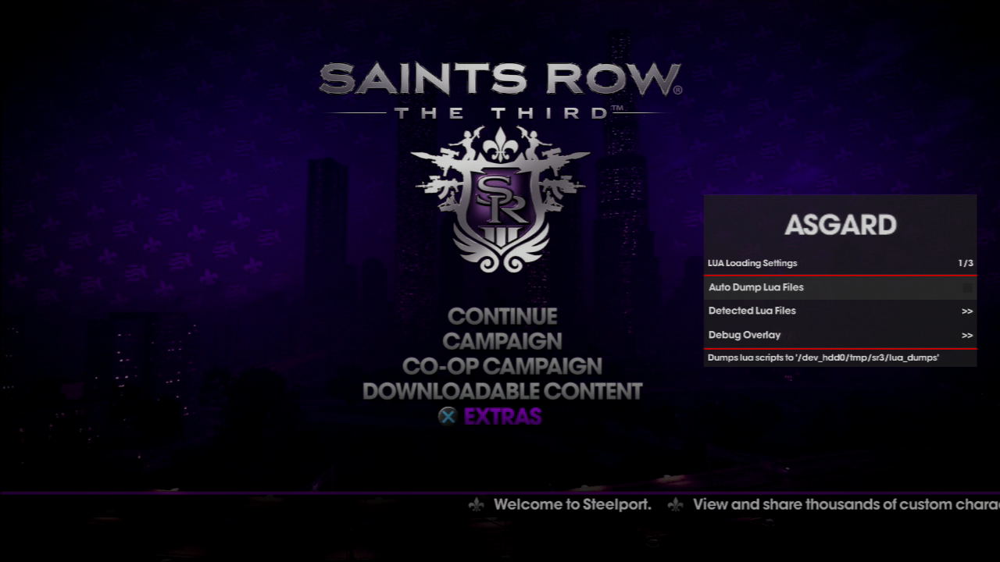
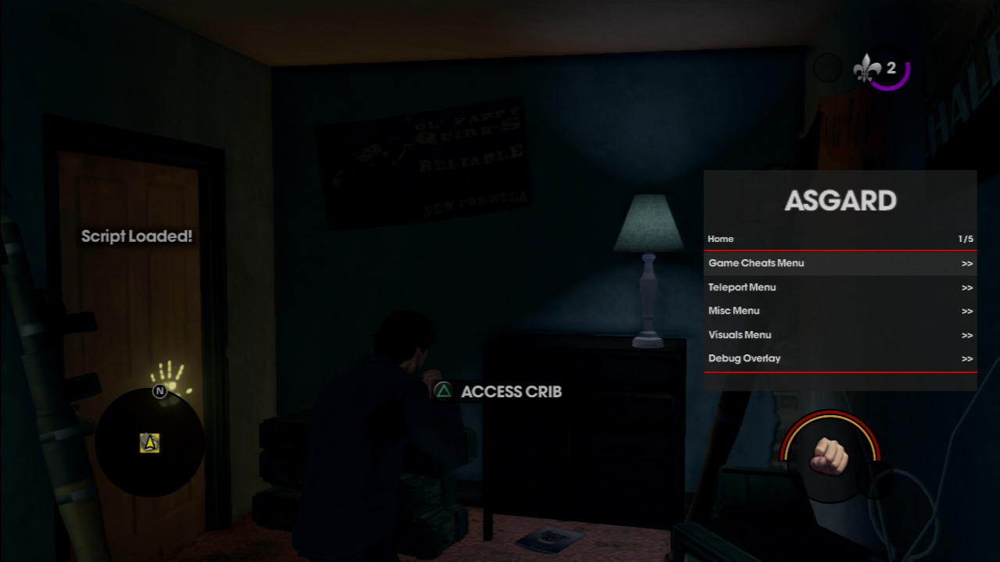
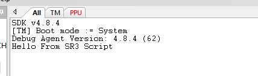

## Asgard Saints Row 3 v2  

For PS3 

To Open Menu: Up DPAD + R3  
To Go Back/Close: Circle  
To Select: X  

Change log:
 + Changed Menu Design
 + Added Option to dump lua scripts from game as they get loaded
    - dump to ``dev_hdd0/tmp/sr3/dumps``
 + Added Support for loading custom lua script 
    - scripts load from file location of ``dev_hdd0/tmp/sr3``
    - Main script 'sr3_city.lua' 
    - Provided a edited sr3_city script just to show it loading
    - Added custom lua function ``mod.print(string)`` for printing to Target Manager output
 + Fixed crashing bugs I could replicate

Main Menu

With custom script loaded what looks like when first load
 

